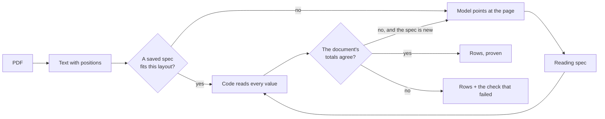

# crossfoot

[](https://github.com/vijaytambe12/crossfoot/actions/workflows/ci.yml)
[](LICENSE)

**Read invoice PDFs with an LLM that never writes a number.**

Ask a language model to extract an invoice and it will hand you clean, well-formed JSON. Some of
it will be wrong, and nothing in the output tells you which part.

crossfoot splits the job differently:

1. **The model points.** It is shown the page as numbered text fragments and answers with *where
   things are*: "records start at fragment 16, the amounts are between x=520 and x=570, the total
   is beside fragment 292". Its answer has no field that can hold a value.
2. **Code reads.** Every value in the output is copied from the PDF's own text by ordinary code.
3. **The document proves it.** The rows are added up and compared with the totals the invoice
   prints. If they do not agree, you are told exactly which check failed.

What the model wrote is saved as a small JSON **reading spec**. The next invoice with that layout
is read in milliseconds, with no model and no network.

```
$ crossfoot invoice.pdf --format csv
Date,Con Note,Receiver,Service,Kg,Freight,Fuel Levy,Total,...
03/08/2026,NF10045800,Acme Trading Co Port Melbourne VIC,Express,4.0,18.50,2.22,20.72,...
04/08/2026,NF10045807,Blue Gum Books Geelong VIC,Road,41.5,97.69,11.72,109.41,...
...
✓ proven · 30 rows · saved spec, no model · spec 1c0707cde8c3
```

("Cross-footing" is the bookkeeper's word for checking that a table's rows and columns add up to
the same total.)

## Try it in a minute, with no API key

The repository ships two example documents and the reading specs for them, so you can watch the
replay path without a model.

```bash
git clone https://github.com/vijaytambe12/crossfoot.git
cd crossfoot
npm install
```

(`npm install` also builds the package into `dist/`.)

Read a two-page freight invoice:

```bash
node dist/cli.js examples/freight-invoice.pdf --specs examples/specs --format csv
```

Now read the same invoice with **one figure misprinted by $10.00** and every total left alone:

```bash
node dist/cli.js examples/freight-invoice-misprint.pdf --specs examples/specs
```

```
✗ NOT PROVEN · 30 rows · saved spec, no model · spec 1c0707cde8c3
  record 7 (page 1): Freight + Fuel Levy adds up to 271.68, but its Total is 261.68
```

You still get the rows. You also get the reason not to trust them, and the exit code is `2`.

The second example has no table at all. Each job is a block of labelled lines with its charges
listed underneath:

```bash
node dist/cli.js examples/courier-statement.pdf --specs examples/specs
```

To see exactly what a model would be shown for a document:

```bash
node dist/cli.js examples/courier-statement.pdf --question
```

## Install

```bash
npm install github:vijaytambe12/crossfoot
```

It is not on the npm registry yet, so install it from GitHub. Node 20 or later. The package is ES
modules only.

## Use it

```js
import { readFile } from 'node:fs/promises';
import { createReader, fileStore, parseAmount } from 'crossfoot';
import { anthropic } from 'crossfoot/anthropic';

const reader = createReader({
  model: anthropic(),          // reads ANTHROPIC_API_KEY; only called for a layout it has not seen
  store: fileStore('./specs'), // one small JSON file per layout
});

const result = await reader.read(await readFile('invoice.pdf'));

result.proven;   // true: the invoice's own totals agree with the rows
result.rows;     // [{ Date: '03/08/2026', 'Con Note': 'NF10045800', Total: '20.72', ... }, ...]
result.via;      // 'written' the first time, 'saved' for every later invoice of the layout
result.problem;  // null, or { check: 'record_total', message: 'record 7 (page 1): ...' }

const total = result.rows.reduce((sum, row) => sum + (parseAmount(row.Total) ?? 0), 0);
```

Three things to know about the result:

- **Values are text, exactly as printed.** `'1,284.36'`, `'(12.50)'`, `'03/08/2026'`. Nothing is
  reformatted, because reformatting is a second chance to be wrong. `parseAmount` turns a printed
  number into a JavaScript number when you want to calculate.
- **Cell names come from the document.** A column is named by the heading printed over it, a
  label by its own text. The model does not invent field names.
- **An unproven read is returned, not thrown.** `proven: false` comes with the rows and with
  `problem`, so you can route it to a person instead of losing the document. Decide in your own
  code whether unproven rows may go further.

`createReader` with no `model` reads only layouts it has a spec for and throws on anything else.
That is the mode to run in production once your layouts are known.

## How it works



**1. The page becomes numbered fragments.** This is the whole of what the model sees:

```
p1 y=170: [8] x=40 w=20 "Date"  [9] x=108 w=40 "Con Note"  [10] x=175 w=38 "Receiver" ... [15] x=537 w=22 "Total"
p1 y=190: [16] x=40 w=45 "03/08/2026"  [17] x=108 w=52 "NF10045800"  [18] x=175 w=70 "Acme Trading Co" ...
p2 y=364: [292] x=420 w=33 "Subtotal"  [293] x=525 w=35 "4,578.16"
```

**2. The model answers by pointing.** Through one tool call whose schema accepts fragment numbers,
x positions, cell names and a few fixed words, and nothing else:

```json
{
  "records": [{ "example": 16, "identify": "whole_text" }],
  "columns": [{ "heading": [15], "left": 520, "right": 570, "fromLine": 1, "toLine": 1, "type": "amount" }],
  "lines":   [{ "example": 292, "role": "end" }, { "example": 294, "role": "tax" }],
  "checks":  [{ "kind": "sum", "cells": ["Total"], "label": 292 }]
}
```

There is no `"total": 4578.16` in there, and there cannot be.

**3. Code checks the answer against the page**, turns it into a reading spec, and reads the whole
document with it: every page, every record.

**4. The document proves the read, or the model is told why not.** A refusal carries evidence the
model can act on, such as "the records add up to 10.00 less than the total, exactly what this line
prints", and it answers again. By default it gets three repairs, then one fresh start.

**5. The proven spec is saved.** It describes the layout, not this invoice, so next month's
invoice is read by code alone. The proof runs again on every read.

More detail, with a full worked example: [docs/how-it-works.md](docs/how-it-works.md).

## What "proven" means

A read is proven only when all of these hold:

- Every line that prints an amount belongs to a record, or is a line the spec names as something
  else (a total, a payment, a charge for the whole invoice).
- Every amount printed inside a record is read by one of its cells.
- Every amount cell holds exactly one number.
- Every text on a record's first line is read by some cell, so a column cannot be silently left
  out.
- Every check holds: records add up to the printed totals, each record's parts add up to its own
  total, and page-to-page "carried forward" figures agree.
- Every record that prints an amount is counted by at least one printed total, so a missing
  record cannot go unseen.

Money is compared to the cent.

Be clear about the boundary. **The proof covers money.** A text cell such as a name or a
reference is read from the place the spec points at, and no total can confirm it. The rules above
make it hard to drop or shift a column without failing, but they are not a proof of text.

Every failure has a code and a plain message: [docs/proof.md](docs/proof.md).

## Any layout, one vocabulary

No code in this package knows any company or any layout. A reading spec describes a document
with a small fixed vocabulary:

| Part | What it says |
|---|---|
| `records` | How a record (one charged item) starts: the shape or the exact text of its first words |
| `columns` | Text between two x positions, on some of a record's lines |
| `labels` | A value printed beside, below or inside a label (`Job No:`, `Surcharge of`) |
| `charges` | Charges listed one per line under a record, each read under its own printed name |
| `lines` | Lines that print amounts but are not records: totals, payments, invoice-level charges and tax |
| `checks` | Which printed totals must agree with the rows |

That covers tables, forms with no table, records that run over several lines, amounts written
inside sentences, and invoices that continue across pages. Full reference:
[docs/reading-spec.md](docs/reading-spec.md).

Specs are plain JSON, a kilobyte or two each. Keep them in files, in git, or in any database.

## Cost, speed and what leaves your machine

| | New layout | Layout with a saved spec |
|---|---|---|
| Model calls | 1 if the first answer is proven, at most 8 by default | 0 |
| Network | Yes, to your model provider | None |
| Time | As long as the model takes | About 10 ms for the two-page example, PDF parsing included |

When a spec is written, the model is sent the document's text: the first two pages that print
amounts and the last one, plus a sample of lines from the pages between. Repairs can add specific
lines as evidence. If that text may not leave your network, write your specs with a model you
host; see below.

`problem.message` and `problem.detail` hold only labels with digits masked, cell names and sums,
so they are safe to log. `problem.evidence` quotes the document.

## Bring your own model

A model is one function. It receives a system prompt, a user prompt and a tool definition, and
returns the input of the tool call:

```ts
type Model = (request: { system: string; prompt: string; tool: ModelTool }) => Promise<unknown>;
```

`crossfoot/anthropic` wraps Claude. Wrapping another provider is about fifteen lines:
[docs/models.md](docs/models.md).

The answer does not have to be right the first time, because nothing unproven is accepted. A
weaker model costs more repair rounds, not wrong numbers.

## Scanned PDFs

A scan has no text layer, so there is nothing to read until you run OCR. crossfoot does not ship
an OCR engine, but it will read any OCR output that gives words and their boxes: build a
`DocumentGeometry` and pass it to `reader.read` in place of the PDF.
[docs/ocr.md](docs/ocr.md) shows how.

## When it fits, and when it does not

**It fits** documents that list items and print totals for them: supplier and carrier invoices,
statements, remittance advices, credit notes.

**It does not fit:**

- Documents with no totals to check against. They can be read, but there is nothing to prove.
- Free prose: contracts, letters, reports.
- One-off layouts. The saving comes from reading the same layout again.
- Handwriting, or scans too poor for OCR.

[docs/limits.md](docs/limits.md) lists the limits in full, including the ones that are easy to
miss.

## Command line

```
crossfoot <file.pdf> [options]

  --specs <dir>     where reading specs are kept          (default ./specs)
  --format <f>      json | csv                            (default json)
  --model <id>      Claude model that writes a new spec   (default claude-opus-5-5)
  --fresh           write this layout's spec again, whatever is saved
  --question        print what the model would be shown, and stop
```

Rows go to stdout and the verdict to stderr, so the output pipes cleanly. Exit code `0` means
proven, `2` means read but not proven, `1` means it could not be read.

## Documentation

- [How it works](docs/how-it-works.md): the pipeline, step by step, on a real example
- [Reading spec reference](docs/reading-spec.md): every field of a spec
- [The proof](docs/proof.md): every check and every failure code
- [Models](docs/models.md): Claude options, other providers, hosting your own
- [OCR](docs/ocr.md): reading scans
- [API reference](docs/api.md): every export
- [Limits and FAQ](docs/limits.md)

## Status

Version 0.1. The reading and proof code is covered by about a hundred tests on made-up documents
of many shapes. The public API may still change before 1.0.

## Contributing

See [CONTRIBUTING.md](CONTRIBUTING.md). The most useful contribution is a layout that does not
read, reduced to a made-up document that shows the problem.

Changes are listed in the [changelog](CHANGELOG.md). To report a vulnerability, see
[SECURITY.md](SECURITY.md).

## License

[MIT](LICENSE)
